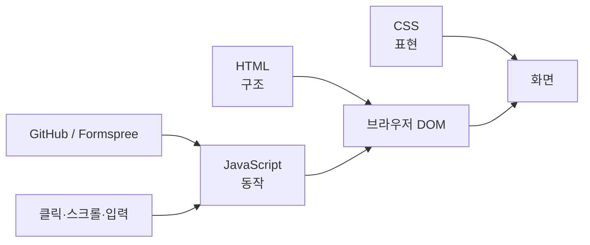

# 00. 처음 보는 사람을 위한 프로젝트 지도

## 1. 이 프로젝트에서 무엇을 배우는가?

이 미션은 포트폴리오 사이트를 만드는 형태지만, 실제 학습 목표는 다음 네 가지다.

- HTML로 문서 구조를 설계한다.
- CSS로 레이아웃과 반응형 화면을 만든다.
- JavaScript로 DOM을 찾고 이벤트를 연결한다.
- API처럼 시간이 걸리는 작업을 비동기로 처리하고 상태에 따라 화면을 바꾼다.

완성 사이트만 보면 하나의 페이지지만 내부적으로는 여러 개념이 연결되어 있다.



---

## 2. 저장소의 파일을 먼저 이해하기

```text
codyssey_B1-1/
├── index.html
├── css/
│   └── style.css
├── js/
│   └── main.js
├── images/
│   ├── profile.png
│   ├── screenshot-desktop.png
│   ├── screenshot-mobile.jpg
│   └── screenshot-dark.png
├── report/
│   ├── LEARNING_NOTES.md
│   ├── 00_START_HERE.md
│   ├── 01_WEB_FOUNDATIONS.md
│   ├── 02_JAVASCRIPT_DOM.md
│   ├── 03_IMPLEMENTATION_MAP.md
│   ├── 04_CODE_WALKTHROUGH.md
│   └── 05_EVALUATION_QA.md
├── .github/workflows/
│   └── pages.yml
└── README.md
```

### index.html

페이지에 **무엇이 있는지** 정의한다.

찾아볼 부분:

- `<header>`: 상단 메뉴
- `#hero`: 첫 화면
- `#about`: 소개
- `#skills`: 기술 목록
- `#projects`: GitHub 프로젝트
- `#contact`: 문의 폼
- `<footer>`: 하단 영역

### css/style.css

페이지가 **어떻게 보이는지** 정의한다.

찾아볼 부분:

- `:root`: 라이트 모드 색상 변수
- `[data-theme="dark"]`: 다크 모드 색상 변수
- `.nav-container`: Flexbox
- `.projects-grid`: Grid
- `@media (min-width: 768px)`: 태블릿 이상
- `@media (min-width: 1024px)`: 데스크톱 이상

### js/main.js

페이지가 **어떻게 움직이는지** 정의한다.

위에서 아래로 크게 다음 순서다.

```text
CONFIG
state
DOM 참조
↓
작은 기능 함수들
↓
Projects API 관련 함수
↓
Form 관련 함수
↓
addEventListener로 이벤트 연결
↓
IntersectionObserver
↓
초기 실행
```

---

## 3. 공부할 때 코드를 어떤 순서로 볼까?

처음부터 main.js 전체를 읽으면 어렵다. 다음 순서가 낫다.

### 1단계: HTML만 보기

브라우저 화면과 `index.html`을 나란히 본다.

예를 들어 화면의 **About**을 본 뒤 HTML에서:

```html
<section class="section" id="about">
```

을 찾는다.

목표는 "이 화면이 HTML의 어느 부분인가?"를 연결하는 것이다.

### 2단계: CSS 붙여 보기

About의 HTML에는 `about-card`, `profile-image`라는 class가 있다.

CSS에서:

```css
.about-card { ... }
.profile-image { ... }
```

를 검색한다.

그러면 "HTML의 class 이름을 CSS가 선택해서 스타일을 적용한다"는 감각을 잡을 수 있다.

### 3단계: JavaScript 기능 하나씩 보기

처음에는 아래 네 개만 본다.

1. 햄버거 메뉴
2. 다크 모드
3. Projects API
4. Contact Form

각 기능은 [04_CODE_WALKTHROUGH.md](04_CODE_WALKTHROUGH.md)에 순서대로 풀어 적었다.

---

## 4. 브라우저 개발자 도구를 공부 도구로 쓰기

Chrome에서 `F12` 또는 `Cmd + Option + I`를 열면 된다.

### Elements 탭

현재 DOM을 볼 수 있다.

다크 모드를 누르고 가장 위 `<html>`을 보면:

```html
<html data-theme="dark">
```

처럼 바뀐다.

즉 JavaScript가 실제로 무엇을 바꾸었는지 직접 확인할 수 있다.

### Console 탭

JavaScript를 직접 시험할 수 있다.

```js
document.querySelector('.theme-toggle')
```

를 입력하면 실제 버튼 DOM 객체가 나온다.

```js
window.scrollY
```

를 입력하면 현재 스크롤 위치를 숫자로 확인할 수 있다.

### Network 탭

GitHub API나 Formspree 요청을 확인한다.

Projects가 로딩될 때 GitHub API 요청이 나타나고, Contact 폼을 보내면 Formspree POST 요청이 나타난다.

이 탭을 보면 `fetch()`가 단순한 문법이 아니라 실제 네트워크 요청을 만드는 코드라는 것을 이해하기 쉽다.

---

## 5. 이 프로젝트를 한 문장으로 설명하기

평가에서 프로젝트 전체 구조를 묻는다면 다음 정도로 설명하면 된다.

> "HTML로 포트폴리오의 시맨틱 구조를 만들고, CSS의 Flexbox와 Grid 및 미디어 쿼리로 모바일 퍼스트 반응형 화면을 구성했습니다. JavaScript에서는 사용자 이벤트를 state 변경으로 연결하고 render 함수가 DOM을 갱신하도록 구성했으며, GitHub API와 Formspree는 fetch와 async/await로 비동기 처리했습니다."

이 문장의 각 용어를 이해하는 것이 이후 문서의 목표다.
