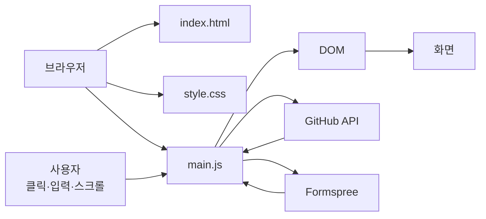

# 00. 프로젝트 전체 그림부터 이해하기

## 1. 완성 화면만 보면 단순하지만 내부에서는 여러 일이 일어난다

이 사이트는 한 페이지짜리 포트폴리오지만 내부적으로 다음 시스템이 연결된다.



### 한 줄 요약

- HTML이 페이지 뼈대를 만든다.
- CSS가 크기/색상/배치를 정한다.
- JavaScript가 버튼, 스크롤, API, 폼을 움직인다.
- GitHub API가 프로젝트 데이터를 준다.
- Formspree가 Contact 메시지를 이메일로 전달한다.

---

## 2. 브라우저가 페이지를 여는 순서

```text
1. URL 접속
2. GitHub Pages가 index.html 전달
3. 브라우저가 HTML 읽기
4. css/style.css 요청
5. js/main.js 요청
6. HTML → DOM 생성
7. CSS 계산 → 화면 그림
8. defer된 main.js 실행
9. 이벤트 listener 등록
10. GitHub API 요청
11. 사용자의 클릭/입력/스크롤을 기다림
```

중요한 점은 **HTML 파일 그 자체와 화면의 DOM은 완전히 같은 개념이 아니라는 것**이다.

- HTML 파일: 저장소에 저장된 원본
- DOM: 브라우저가 HTML을 읽어 메모리에 만든 객체 구조
- JavaScript: DOM을 바꿔서 현재 화면을 바꿈

---

## 3. 파일별 책임

```text
codyssey_B1-1/
├── index.html              구조와 콘텐츠
├── css/style.css           디자인과 반응형 레이아웃
├── js/main.js              동작과 상태
├── images/                 이미지/스크린샷
├── report/                 학습 자료
└── .github/workflows/      GitHub Pages 배포
```

### index.html에서 찾을 것

| 화면 | 검색어 |
| --- | --- |
| 상단 메뉴 | `site-header`, `nav-container` |
| 첫 화면 | `id="hero"` |
| 자기소개 | `id="about"` |
| 기술 | `id="skills"` |
| 프로젝트 | `id="projects"` |
| 문의 | `id="contact"` |
| 하단 | `site-footer` |

### style.css에서 찾을 것

| 개념 | 검색어 |
| --- | --- |
| 색상 변수 | `:root` |
| 다크모드 | `[data-theme="dark"]` |
| Flexbox | `.nav-container` |
| Grid | `.projects-grid` |
| 모바일 메뉴 | `.menu-toggle`, `.nav-links` |
| 768px | `@media (min-width: 768px)` |
| 1024px | `@media (min-width: 1024px)` |

### main.js에서 찾을 것

| 기능 | 검색어 |
| --- | --- |
| 설정 | `CONFIG` |
| 화면 상태 | `state` |
| DOM 선택 | `DOM` |
| 테마 | `renderTheme` |
| 햄버거 | `renderMenu` |
| 스크롤 | `handleScroll` |
| 타이핑 | `startTyping` |
| 프로젝트 API | `fetchProjects` |
| 프로젝트 화면 | `renderProjects` |
| 폼 검사 | `validateField` |
| 폼 전송 | `submitForm` |

---

## 4. 기능 하나를 이해하는 공식

기능 하나를 볼 때 항상 네 질문만 한다.

### Q1. HTML에서 어떤 요소인가?
예: 다크모드 → `.theme-toggle` 버튼

### Q2. CSS에서 어떤 모습인가?
예: `:root`, `[data-theme="dark"]`

### Q3. JS에서 어떤 이벤트를 받나?
예: `themeButton.addEventListener('click', ...)`

### Q4. 이벤트 뒤 무엇이 바뀌나?
예: `state.theme → renderTheme() → data-theme → CSS 변수`

이 방식으로 보면 코드를 처음부터 끝까지 읽을 필요가 없다.

---

## 5. 가장 먼저 직접 확인할 5가지

### ① 모바일 햄버거
브라우저 폭을 767px로 줄인다.

```text
☰ 클릭
→ 메뉴 열림
→ 다시 클릭
→ 메뉴 닫힘
```

### ② 다크모드
Dark 클릭 → 새로고침 → 유지 확인

### ③ 스크롤
60px 이후 header 변화, 300px 이후 ↑ 버튼 확인

### ④ Projects
Network 탭에서 GitHub API 요청 확인

### ⑤ Contact
잘못된 이메일 → 오류 → 정상 입력 → 실제 이메일 전송

---

## 6. 개발자 도구 세 탭만 알면 공부가 빨라진다

### Elements
현재 DOM과 적용 CSS 확인

추천 실험:
- Dark 클릭 후 `<html data-theme="dark">` 확인
- 햄버거 클릭 후 `.nav-links.active` 확인

### Console
JavaScript 직접 실행

```js
document.querySelector('.theme-toggle')
window.scrollY
localStorage.getItem('portfolio-theme')
```

### Network
네트워크 요청 확인

- GitHub API → GET
- Formspree → POST

---

## 7. 전체 프로젝트 한 문장 설명

> HTML로 콘텐츠 구조를 만들고, CSS의 변수·Flexbox·Grid·미디어 쿼리로 반응형 화면을 구성했으며, JavaScript에서 사용자 이벤트와 API 응답을 state 변경으로 연결하고 render 함수가 DOM을 갱신하도록 만든 Vanilla JavaScript 포트폴리오다.
