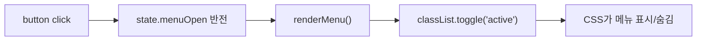

# 02. JavaScript / DOM / 이벤트 / 비동기 기초

## 1. JavaScript가 이 프로젝트에서 하는 일

HTML과 CSS만 있어도 정적인 페이지는 보인다. 하지만 다음 기능은 JavaScript가 담당한다.

- 햄버거 메뉴 열기/닫기
- 다크모드
- 부드러운 스크롤
- 스크롤 위치에 따른 헤더/Top 버튼 변화
- 타이핑 효과
- GitHub API 호출과 카드 생성
- 언어 필터
- 폼 유효성 검사
- Formspree 전송
- 스크롤 등장 애니메이션

---

## 2. const와 let

### const

변수 자체를 다른 값으로 다시 대입하지 않을 때 사용한다.

```js
const FORM_FIELDS = ['name', 'email', 'message'];
```

### let

값이 계속 바뀌는 변수에 사용한다.

```js
let index = 0;
index += 1;
```

### const 객체는 왜 내부 값이 바뀌나?

```js
const state = { theme: 'light' };
state.theme = 'dark';
```

는 가능하다.

`const`는 state라는 이름이 **다른 객체를 가리키도록 재대입하는 것**을 막는다. 객체 내부 속성 변경까지 금지하는 것은 아니다.

---

## 3. 데이터 타입

이 프로젝트에서 보면:

| 종류 | 예 |
| --- | --- |
| 문자열 | `'dark'`, `'loading'` |
| 숫자 | `60`, `300`, `0.2` |
| Boolean | `true`, `false` |
| 배열 | `['name', 'email', 'message']` |
| 객체 | `{ theme: 'light' }` |

### 배열

여러 값을 순서대로 저장한다.

### 객체

이름이 있는 속성을 묶는다.

```js
const state = {
  theme: 'light',
  menuOpen: false
};
```

---

## 4. 함수

함수는 하나의 작업을 묶은 코드다.

```js
const renderMenu = () => {
  ...
};
```

실행:

```js
renderMenu();
```

우리 main.js의 핵심 함수:

| 함수 | 책임 |
| --- | --- |
| getInitialTheme | 처음 테마 결정 |
| renderTheme | 테마 상태를 화면에 반영 |
| renderMenu | 메뉴 상태 반영 |
| handleScroll | 스크롤 UI 처리 |
| startTyping | 타이핑 효과 |
| projectCard | 저장소 1개를 카드 HTML로 변환 |
| visibleProjects | 필터 결과 계산 |
| renderProjectFilters | 필터 버튼 생성 |
| renderProjects | Projects 상태별 화면 표시 |
| fetchProjects | GitHub API 요청 |
| validateField | 폼 값 검사 |
| renderFieldError | 오류를 DOM에 표시 |
| submitForm | Formspree 전송 |

---

## 5. 화살표 함수

```js
const getStoredTheme = () =>
  localStorage.getItem(CONFIG.themeStorageKey);
```

일반 함수로 생각하면:

```js
function getStoredTheme() {
  return localStorage.getItem(CONFIG.themeStorageKey);
}
```

정도로 이해하면 된다.

---

## 6. 조건문과 엄격 비교

```js
if (storedTheme === 'light' || storedTheme === 'dark') {
  return storedTheme;
}
```

조건이 참이면 실행한다.

`===`는 값뿐 아니라 타입까지 엄격하게 비교한다. 예측하기 어려운 자동 타입 변환을 피하기 위해 이 프로젝트에서는 엄격 비교를 사용한다.

---

## 7. 삼항 연산자

```js
state.theme = state.theme === 'dark' ? 'light' : 'dark';
```

해석:

```text
현재 theme이 dark?
├─ yes → light
└─ no  → dark
```

짧은 if/else 표현이다.

---

# DOM

## 8. DOM이란?

브라우저가 HTML을 읽어 JavaScript가 다룰 수 있는 객체 트리로 만든 것이 DOM이다.

HTML:

```html
<button class="theme-toggle">Dark</button>
```

JavaScript:

```js
document.querySelector('.theme-toggle')
```

는 실제 화면의 그 버튼을 나타내는 DOM 객체를 반환한다.

JavaScript는 원본 HTML 파일을 수정하는 게 아니라 **현재 브라우저 메모리에 있는 DOM을 수정**한다.

---

## 9. querySelector와 querySelectorAll

### querySelector

첫 번째 요소 하나:

```js
document.querySelector('.site-header')
```

### querySelectorAll

조건에 맞는 모든 요소:

```js
document.querySelectorAll('a[href^="#"]')
```

여러 링크 각각에 이벤트를 걸 때 사용한다.

---

## 10. DOM 객체를 따로 모은 이유

main.js:

```js
const DOM = {
  header: document.querySelector('.site-header'),
  menuButton: document.querySelector('.menu-toggle'),
  ...
};
```

장점:

- 같은 요소를 매번 다시 찾지 않음
- 코드에서 `DOM.themeButton`처럼 의미가 드러남
- 화면 요소(DOM)와 상태(state)를 구분할 수 있음

---

## 11. DOM을 바꾸는 세 가지 방법

### textContent

텍스트 변경:

```js
DOM.themeButton.textContent = 'Light';
```

### innerHTML

내부 HTML 구조 생성/교체:

```js
DOM.projectsGrid.innerHTML = projects.map(projectCard).join('');
```

### classList

class 추가/삭제/토글:

```js
DOM.header.classList.add('scrolled');
DOM.formStatus.classList.remove('error', 'success');
DOM.navLinks.classList.toggle('active', state.menuOpen);
```

CSS는 class를 보고 다른 모양을 적용한다. 따라서 JavaScript와 CSS가 class를 매개로 연결된다.

---

# 이벤트

## 12. 이벤트란?

브라우저에서 일어나는 사건이다.

우리 프로젝트:

- `click`: 클릭
- `scroll`: 스크롤
- `input`: 입력
- `submit`: 폼 제출
- 시스템 색상 모드의 `change`

이벤트 연결:

```js
DOM.themeButton.addEventListener('click', () => {
  ...
});
```

---

## 13. event 객체와 preventDefault

```js
link.addEventListener('click', (event) => {
  event.preventDefault();
});
```

event에는 해당 사건의 정보가 들어 있다.

`preventDefault()`는 브라우저의 기본 동작을 막는다.

이 프로젝트에서는:

- 앵커 링크의 즉시 점프를 막고 부드러운 스크롤 사용
- 폼의 기본 제출을 막고 검증 후 fetch로 직접 전송

---

# 상태와 렌더링

## 14. state란?

상태(state)는 **현재 화면을 결정하는 데이터**다.

main.js:

```js
const state = {
  theme: 'light',
  menuOpen: false,
  projects: {
    status: 'idle',
    items: [],
    selectedLanguage: 'All',
    errorMessage: ''
  },
  form: {
    errors: {},
    submitStatus: 'idle'
  }
};
```

예:

- theme = dark → 다크 화면
- menuOpen = true → 모바일 메뉴 열림
- projects.status = loading → "로딩 중"
- selectedLanguage = Python → Python 저장소만 표시

---

## 15. render 함수란?

state 자체는 화면에 보이지 않는다.

state를 읽어 DOM에 반영하는 함수가 render 함수다.

예:

```text
state.menuOpen = true
        ↓
renderMenu()
        ↓
.nav-links에 active class
        ↓
CSS .nav-links.active 적용
        ↓
메뉴 표시
```

이것이 미션에서 강조한 **이벤트 → 상태 → 렌더링**이다.

---

## 16. 햄버거 메뉴 흐름



코드 위치:

- 상태: `state.menuOpen`
- 렌더링: `renderMenu()`
- 이벤트: `DOM.menuButton.addEventListener('click', ...)`
- CSS: `.nav-links`, `.nav-links.active`, `.menu-toggle.active`

---

## 17. 다크모드 흐름

```text
Dark 버튼 click
→ state.theme 변경
→ renderTheme()
→ <html data-theme="dark">
→ CSS [data-theme="dark"] 변수 적용
→ localStorage 저장
~~~

새로고침 시:

```text
getInitialTheme()
├─ localStorage 저장값 있음 → 저장값
└─ 없음 → prefers-color-scheme 사용
```

---

# 배열 메서드와 ES6+

## 18. map / filter / forEach

### map

각 값을 다른 값으로 변환한 새 배열을 만든다.

```js
projects.map(projectCard)
```

repository 객체 배열 → HTML 문자열 배열

### filter

조건을 통과하는 값만 새 배열로 만든다.

```js
items.filter(({ language }) => language === selectedLanguage)
```

### forEach

각 요소에 작업을 수행한다.

```js
FORM_FIELDS.forEach((name) => {
  ...
});
```

---

## 19. 구조분해 할당

```js
const projectCard = ({
  name,
  description,
  html_url,
  language,
  stargazers_count
}) => ...
```

GitHub repository 객체에는 많은 속성이 있다. 그중 필요한 것만 이름으로 꺼내 쓴다.

또:

```js
const { items, selectedLanguage } = state.projects;
```

도 같은 개념이다.

---

## 20. 템플릿 리터럴

백틱을 사용하면 문자열 안에 값을 넣고 여러 줄을 쉽게 작성할 수 있다.

프로젝트 카드가 대표 예다.

```js
const projectCard = ({ name }) => `
  <article>
    <h3>${name}</h3>
  </article>
`;
```

우리 코드에서는 외부 API 문자열을 그대로 넣지 않고 `escapeHtml()`을 거쳐 HTML 특수문자를 치환한다.

---

# 비동기

## 21. 동기와 비동기

네트워크 요청은 즉시 끝나지 않는다.

GitHub 서버 응답을 기다리는 동안 브라우저 전체가 멈추면 안 된다. 그래서 비동기 작업으로 처리한다.

```js
const response = await fetch(url);
const projects = await response.json();
```

`await`는 현재 async 함수의 다음 실행을 잠시 기다리게 하지만, 브라우저 전체를 멈추는 방식은 아니다.

---

## 22. Promise를 어떻게 이해하면 되나?

Promise는 "지금 결과가 없지만 나중에 성공하거나 실패할 작업"을 나타내는 객체라고 생각하면 된다.

`fetch()`는 즉시 API 데이터 자체를 주는 것이 아니라 Promise를 반환한다.

```text
fetch()
  ↓ Promise
요청 진행 중
  ↓
성공 또는 실패
```

`await`를 사용하면 Promise의 완료 결과를 일반 값처럼 받아 다음 줄에서 사용할 수 있다.

---

## 23. fetch와 response.ok

중요한 점:

`fetch()`는 인터넷 연결 자체가 실패하면 reject되지만, HTTP 404/403/500은 response를 받을 수 있다.

그래서:

```js
if (!response.ok) {
  ...
}
```

를 직접 확인한다.

우리 GitHub API에서는 403을 별도로 처리한다.

---

## 24. try / catch / finally

### try

실패할 수 있는 작업

### catch

오류가 발생했을 때

### finally

성공/실패와 상관없이 마지막에 실행

Formspree 전송에서는:

```text
try
 └─ fetch 전송
catch
 └─ 실패 메시지
finally
 └─ 버튼 disabled 해제
```

를 사용한다.

---

## 25. API 상태가 왜 필요한가?

Projects는 단순히 "데이터 있음/없음"이 아니다.

```text
idle
 ↓
loading
 ├─ success
 ├─ empty
 └─ error
```

사용자에게 현재 상황을 알려주기 위해 별도 상태가 필요하다.

`renderProjects()`는 `state.projects.status`에 따라 다른 UI를 그린다.

---

# 브라우저 API

## 26. localStorage

브라우저가 작은 문자열 데이터를 저장한다.

```js
localStorage.setItem('portfolio-theme', 'dark');
localStorage.getItem('portfolio-theme');
```

새로고침 후에도 남아서 다크모드 설정 유지에 사용한다.

---

## 27. matchMedia

```js
window.matchMedia('(prefers-color-scheme: dark)')
```

운영체제/브라우저의 다크모드 선호를 확인한다.

저장된 사용자 선택이 없을 때 초기 테마 결정에 사용한다.

---

## 28. IntersectionObserver

요소가 viewport와 교차하는지 브라우저가 관찰한다.

```js
new IntersectionObserver(callback, {
  threshold: 0.2
});
```

threshold 0.2는 대상 요소가 약 20% 보이면 callback이 실행된다는 의미다.

보이면 `visible` class를 붙여 CSS animation을 실행하고, 한 번 실행한 뒤 `unobserve()`한다.

---

# Form

## 29. 폼 검증 흐름

```text
사용자 input
→ validateField()
→ state.form.errors 변경
→ renderFieldError()
→ 오류 텍스트 + invalid class
```

submit에서는 모든 필드를 다시 검사한다.

이메일은 정규표현식으로 기본 형식을 확인한다.

---

## 30. FormData

```js
new FormData(DOM.form)
```

form 안의 name/value를 전송 가능한 데이터로 만든다.

Formspree에 POST body로 넘긴다.

실제 배포 페이지에서 테스트했고 이메일 수신까지 확인했다.

---

## 31. 이 문서의 핵심 암기 포인트

JavaScript 평가 전에 다음만 자신의 말로 설명할 수 있으면 된다.

1. DOM이 무엇인가?
2. querySelector와 querySelectorAll 차이는?
3. addEventListener가 무엇인가?
4. state가 왜 필요한가?
5. event → state → render 흐름을 예로 설명할 수 있는가?
6. map/filter/forEach 차이는?
7. fetch와 async/await는 왜 쓰는가?
8. loading/success/error/empty를 왜 나누는가?
9. localStorage는 무엇인가?
10. IntersectionObserver는 왜 썼는가?
