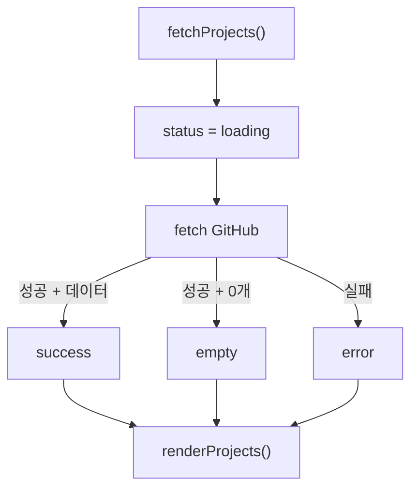

# 03. 미션 요구사항 → 실제 코드 위치 지도

이 문서는 "구현했다는데 **어디를 보면 되는지 모르겠다**"를 해결하기 위한 문서다.

코드를 볼 때 GitHub에서 파일을 연 뒤 **브라우저 검색(Ctrl/Cmd + F)** 으로 아래 selector나 함수 이름을 검색하면 된다.

---

## 1. 전체 요구사항 지도

| 요구사항 | HTML 위치 | CSS 위치 | JavaScript 위치 |
| --- | --- | --- | --- |
| Header/Nav | `<header class="site-header">`, `.nav-container` | `.site-header`, `.nav-container` | `DOM.header`, `handleScroll()` |
| Hero | `#hero` | `.hero`, `.hero-copy` | `startTyping()` |
| About | `#about` | `.about-card`, `.profile-image` | 스크롤 Observer |
| Skills | `#skills` | `.skill-list` | 스크롤 Observer |
| Projects | `#projects`, `.projects-grid` | `.projects-grid`, `.project-card` | `fetchProjects()`, `renderProjects()` |
| Contact | `#contact`, `#contact-form` | `.contact-form`, `.field-error` | `validateField()`, `submitForm()` |
| Footer | `<footer>` | `.site-footer` | 현재 연도 설정 |
| 햄버거 | `.menu-toggle`, `.nav-links` | `.menu-toggle.active`, `.nav-links.active` | `renderMenu()` + click listener |
| 다크모드 | `.theme-toggle` | `[data-theme="dark"]` | `getInitialTheme()`, `renderTheme()` |
| Scroll Top | `.scroll-top` | `.scroll-top.visible` | `handleScroll()`, click listener |
| Reveal | `.reveal` | `.reveal.visible`, `@keyframes reveal-in` | `IntersectionObserver` |
| Formspree | `data-endpoint=...` | submit 상태 스타일 | `submitForm()` |

---

# HTML 요구사항

## 2. 시맨틱 태그

파일: **index.html**

검색:

```text
<header
<nav
<main
<section
<article
<footer
```

### 실제 구조

- `header`: 사이트 상단
- `nav`: 탐색 메뉴
- `main`: 주요 콘텐츠
- `section`: Hero/About/Skills/Projects/Contact
- `article`: About 카드, JS가 생성하는 Project 카드
- `footer`: 하단

---

## 3. 각 섹션 Anchor

파일: **index.html**

메뉴:

```html
<a href="#about">About</a>
<a href="#skills">Skills</a>
<a href="#projects">Projects</a>
<a href="#contact">Contact</a>
```

각 목적지는:

```html
<section id="about">
<section id="skills">
<section id="projects">
<section id="contact">
```

으로 연결된다.

---

## 4. 이미지 alt

파일: **index.html**

검색: `profile-image`

```html

```

---

## 5. label과 input

파일: **index.html**

예:

```html
<label for="email">이메일</label>
<input id="email" name="email" type="email">
```

`for`와 `id`가 일치한다.

---

# CSS 요구사항

## 6. CSS 변수

파일: **css/style.css**

검색:

```text
:root
[data-theme="dark"]
```

라이트/다크가 같은 컴포넌트 CSS를 공유하고 변수 값만 변경한다.

---

## 7. Flexbox Navigation

검색: `.nav-container`

```css
.nav-container {
  display: flex;
  ...
}
```

---

## 8. Grid Projects

검색: `.projects-grid`

```css
grid-template-columns:
  repeat(auto-fit, minmax(250px, 1fr));
```

1024px 이상에서는 최소 카드 폭을 290px로 조정한다.

---

## 9. Mobile First / Breakpoint

검색:

```text
@media (min-width: 768px)
@media (min-width: 1024px)
```

기본 규칙이 모바일이고 큰 화면에서 덮어쓴다.

---

## 10. Hover / Transition / Shadow

검색:

- `.button`
- `.button:hover`
- `.project-card`
- `.project-card:hover`
- `box-shadow`
- `transition`

---

# JavaScript 기본 요구사항

## 11. defer

파일: **index.html**

```html
<script src="js/main.js" defer></script>
```

---

## 12. const / let

파일: **js/main.js**

- 대부분의 참조/객체: `const`
- 타이핑 인덱스: `let index = 0`
- `var`는 사용하지 않는다.

---

## 13. querySelector / querySelectorAll

검색:

```js
document.querySelector(...)
document.querySelectorAll(...)
```

DOM 객체 모음은 `const DOM = {...}`에 있다.

---

## 14. textContent / innerHTML

### textContent

- Theme 버튼 글자
- Form 상태 메시지
- Field 오류
- 타이핑 효과
- Footer 연도

검색: `.textContent`

### innerHTML

- Project 필터 버튼
- Project 상태 메시지
- Project 카드

검색: `.innerHTML`

---

## 15. classList add/remove/toggle

검색: `classList`

대표:

- `add('scrolled')`
- `remove('scrolled')`
- `toggle('active', state.menuOpen)`

---

## 16. 네 종류 이벤트

검색:

```text
addEventListener('click'
addEventListener('submit'
addEventListener('scroll'
addEventListener('input'
```

---

# 인터랙션 요구사항

## 17. 햄버거 메뉴

### HTML

- `.menu-toggle`
- `.nav-links`

### JS

`renderMenu()`:

```text
state.menuOpen
→ navLinks active class
→ menuButton active class
→ aria-expanded
```

click listener가 `state.menuOpen = !state.menuOpen`으로 상태를 반전한다.

---

## 18. 부드러운 스크롤

JS에서 검색: `scrollIntoView`

Anchor 클릭을 잡아:

```js
event.preventDefault();
target.scrollIntoView({ behavior: 'smooth' });
```

로 이동한다.

---

## 19. Scroll Top 300px

설정값:

```js
scrollTopThreshold: 300
```

함수: `handleScroll()`

300px 이상이면:

```js
DOM.scrollTopButton.classList.add('visible')
```

클릭하면:

```js
window.scrollTo({ top: 0, behavior: 'smooth' })
```

---

## 20. Header 60px

설정값:

```js
navScrollThreshold: 60
```

`handleScroll()`에서 `scrolled` class를 add/remove 한다.

CSS에서는 `.site-header.scrolled`이 배경과 shadow를 적용한다.

---

## 21. 다크모드 + 저장

관련 코드:

- `getStoredTheme()`
- `getInitialTheme()`
- `renderTheme()`
- Theme button click listener

저장:

```js
localStorage.setItem(...)
```

CSS 연결:

```js
document.documentElement.dataset.theme = state.theme;
```

→ `<html data-theme="dark">`

→ CSS `[data-theme="dark"]`

---

## 22. 시스템 다크모드 보너스

검색:

```js
window.matchMedia('(prefers-color-scheme: dark)')
```

저장된 테마가 없을 때 시스템 설정을 따른다.

---

## 23. 스크롤 애니메이션

설정:

```js
revealThreshold: 0.2
```

검색: `IntersectionObserver`

보이면 `visible` class를 추가한다.

CSS:

- `.reveal.visible`
- `@keyframes reveal-in`

---

## 24. 타이핑 효과 보너스

HTML:

```html
<p class="hero-copy typing"
   data-text="Operations Research를 ...">
```

JS: `startTyping()`

`slice(0, index)`로 문자열 앞부분을 한 글자씩 늘려서 `textContent`에 넣고 `setTimeout`으로 반복한다.

---

# ES6+ / 배열

## 25. 화살표 함수

main.js의 대부분의 함수와 callback.

예:

```js
const visibleProjects = () => { ... };
```

---

## 26. 구조분해 할당

Project 카드:

```js
const projectCard = ({
  name,
  description,
  html_url,
  language,
  stargazers_count
}) => ...
```

Projects 상태:

```js
const { status, errorMessage } = state.projects;
```

---

## 27. map

repository 배열 → 카드 문자열 배열:

검색:

```js
projects.map(projectCard)
```

필터 버튼도 `map()`으로 만든다.

---

## 28. filter

언어 필터:

```js
items.filter(({ language }) =>
  language === selectedLanguage
)
```

또한 null 언어를 제외할 때도 사용한다.

---

## 29. forEach

사용 위치:

- 모든 anchor link에 click listener
- 모든 form field에 input listener
- 모든 reveal 요소 observe
- 모든 field 오류 렌더링

---

# GitHub API

## 30. API endpoint

`CONFIG.githubUser = 'seaweedsoup98'`

`fetchProjects()` 내부:

```text
https://api.github.com/users/seaweedsoup98/repos
```

---

## 31. loading / success / error / empty

관련 state:

```js
state.projects.status
```

관련 함수:

```text
fetchProjects()
renderProjects()
```

흐름:



403이면 rate-limit 전용 메시지를 설정한다.

---

## 32. 재시도 버튼

error 상태의 HTML은 `renderProjects()`가 동적으로 만든다.

class: `.retry-projects`

Projects container 자체에 click listener를 걸고:

```js
event.target.closest('.retry-projects')
```

를 이용해 동적으로 생성된 버튼 클릭을 감지한다.

이 방식을 **이벤트 위임**이라고 부른다.

---

# Contact Form

## 33. 필수값 검사

함수: `validateField()`

`trim()` 후 빈 문자열인지 확인한다.

---

## 34. 이메일 검사

`validateField()` 안의 정규표현식으로 기본 email 형식을 검사한다.

---

## 35. 에러 메시지

함수: `renderFieldError()`

- `.field-error`에 textContent
- input에 `invalid` class
- `aria-invalid` 상태 변경

---

## 36. submit + preventDefault

Contact submit listener:

```js
event.preventDefault();
```

기본 페이지 이동 제출 대신 JavaScript가:

1. 검증
2. 오류 표시
3. 성공하면 `submitForm()`

을 수행한다.

---

## 37. Formspree 실제 전송

HTML:

```html
data-endpoint="https://formspree.io/f/myezkwbk"
```

JS: `submitForm()`

- method: POST
- body: `new FormData(DOM.form)`
- Accept: application/json

실제 배포 환경에서 테스트했고 이메일 수신까지 확인했다.

---

# 최종 기능 ↔ 코드 핵심 경로

평가 직전에는 아래만 빠르게 확인하면 된다.

```text
index.html
├─ nav
├─ hero
├─ about
├─ skills
├─ projects (빈 container)
└─ contact form

style.css
├─ :root / dark variables
├─ nav flex
├─ projects grid
├─ component styles
└─ media queries

main.js
├─ CONFIG
├─ state
├─ DOM
├─ theme/menu/scroll/typing
├─ project render + fetch
├─ form validation + submit
├─ event listeners
├─ observer
└─ initial execution
```
