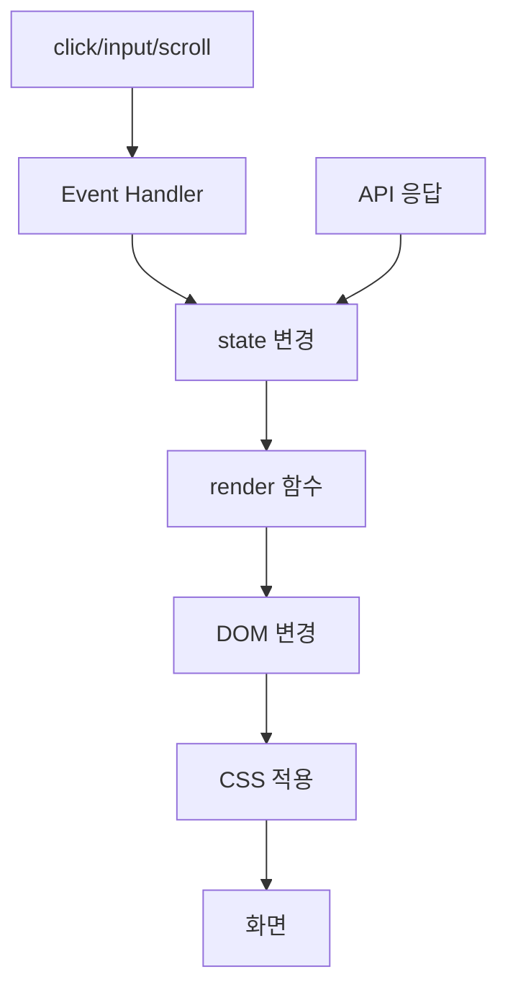

# 04. 실제 실행 흐름 따라가기

# 1. 페이지를 처음 열면

main.js 맨 아래가 출발점이다.

```text
state.theme = getInitialTheme()
renderTheme(false)
renderMenu()
handleScroll()
startTyping()
fetchProjects()
현재 연도 표시
```

## getInitialTheme
```text
localStorage 확인
├─ 저장값 있음 → 저장값
└─ 없음 → 시스템 dark mode 확인
```

## renderTheme(false)
state.theme을 DOM에 반영하지만 초기 시스템값을 사용자 선택처럼 저장하지는 않는다.

## renderMenu
menuOpen=false를 화면에 반영.

## handleScroll
처음 로드 위치의 header/Top 버튼 상태 맞춤.

## startTyping
Hero 문구 시작.

## fetchProjects
GitHub API 요청 시작.

---

# 2. Dark 버튼

```text
사용자 click
→ theme button callback
→ state.theme 반전
→ renderTheme()
→ html data-theme 변경
→ localStorage 저장
→ CSS 변수 교체
→ 화면 변경
```

중요:
JavaScript가 카드 하나하나의 색을 바꾸는 것이 아니다.

```text
JS: data-theme만 바꿈
CSS: 변수값을 바꿈
모든 컴포넌트: var(...)를 사용
```

---

# 3. 햄버거

```text
초기 menuOpen=false
↓
버튼 click
↓
menuOpen=true
↓
renderMenu()
↓
nav-links active
menu-toggle active
aria-expanded=true
↓
CSS display:flex
```

다시 click → false → active 제거.

768px 이상에서는 CSS가 햄버거 자체를 숨긴다.

---

# 4. 내부 메뉴 링크

예: Projects 클릭.

```text
href="#projects"
↓
document.querySelector('#projects')
↓
preventDefault()
↓
scrollIntoView({behavior:'smooth'})
↓
menuOpen=false
↓
renderMenu()
```

모바일에서는 이동 후 메뉴도 자동으로 닫힌다.

---

# 5. 스크롤

window scroll 이벤트마다 `handleScroll()`.

## 60px
```text
scrollY >= 60
→ header.add('scrolled')
→ CSS 배경/blur/shadow
```

## 300px
```text
scrollY >= 300
→ scrollTopButton.add('visible')
→ 버튼 표시
```

Top click:
```text
window.scrollTo(top=0, smooth)
```

---

# 6. 등장 애니메이션

```text
.reveal 요소 등록
↓
IntersectionObserver 관찰
↓
viewport와 20% 교차
↓
entry.isIntersecting=true
↓
visible class
↓
CSS reveal-in
↓
unobserve
```

한 번 나타난 뒤 계속 감시하지 않는다.

---

# 7. GitHub Projects — 전체 흐름

## 7-1. 요청 시작
```text
status='loading'
errorMessage=''
renderProjectFilters()
renderProjects()
```

화면에는 즉시 "프로젝트 로딩 중..." 표시.

## 7-2. fetch
```js
await fetch(...)
```

## 7-3. 응답 검사
```text
response.ok?
├─ false + 403 → RATE_LIMIT
├─ false       → REQUEST_FAILED
└─ true        → json()
```

## 7-4. 데이터 저장
```text
projects 배열
→ state.projects.items
→ 길이 0? empty : success
```

## 7-5. 필터 생성
```text
items
→ map(language)
→ filter(Boolean)
→ Set
→ sort
→ ['All', ...languages]
→ map(button HTML)
→ join('')
→ projectFilters.innerHTML
```

## 7-6. 카드 생성
```text
visibleProjects()
→ filter 필요 시 적용
→ map(projectCard)
→ HTML 문자열 배열
→ join('')
→ projectsGrid.innerHTML
```

---

# 8. 언어 필터

필터 버튼은 API 성공 뒤 동적으로 생긴다.

부모 `.project-filters`가 click을 받고:

```text
event.target.closest('[data-language]')
↓
selectedLanguage 변경
↓
renderProjectFilters()
↓
renderProjects()
```

이게 이벤트 → 상태 → 렌더링 패턴의 대표 예다.

---

# 9. Retry

error 상태에서 Retry 버튼도 동적으로 생긴다.

부모 Projects grid listener가:

```js
event.target.closest('.retry-projects')
```

를 찾아 다시 `fetchProjects()`.

동적으로 생긴 자식의 이벤트를 부모가 처리하는 방식 = **이벤트 위임**.

---

# 10. Form 입력

각 field에 input listener.

```text
사용자 입력
↓
validateField(name, value)
↓
state.form.errors[name]
↓
renderFieldError(name)
↓
오류 text + invalid class + aria-invalid
```

---

# 11. Form submit

```text
submit
↓
preventDefault
↓
모든 field validate
↓
errors 갱신
↓
하나라도 오류?
├─ yes → 메시지 + 종료
└─ no  → submitForm()
```

input 때 검사하더라도 submit 때 전부 다시 검사한다.

이유:
사용자가 필드를 한 번도 건드리지 않고 바로 제출할 수 있기 때문.

---

# 12. Formspree

submitForm:

```text
버튼 disabled
↓
'전송 중...'
↓
FormData 생성
↓
POST fetch
↓
response.ok?
├─ 성공 → reset + 성공 메시지
└─ 실패 → 실패 메시지
↓
finally
↓
버튼 활성화 + '보내기'
```

실제 배포 사이트에서 이메일 수신까지 확인했다.

---

# 13. 이 프로젝트의 핵심 구조



이 그림을 이해하면 프로젝트 전체 설계의 중심을 이해한 것이다.
