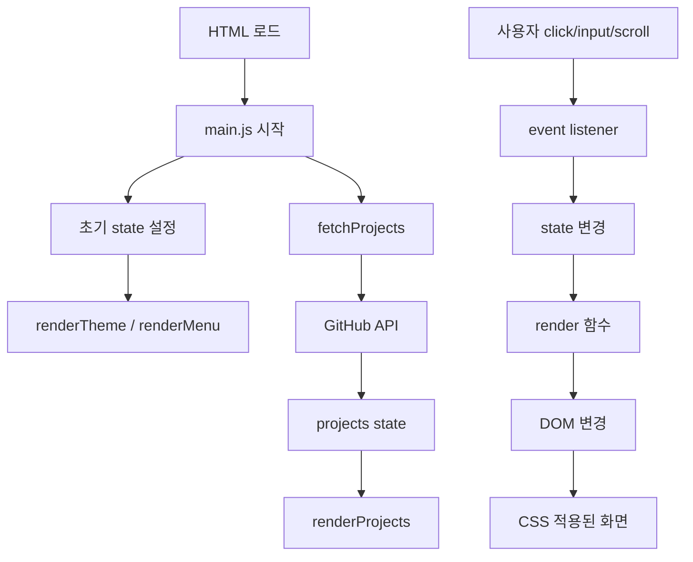

# 04. 실제 코드 실행 흐름 따라가기

이 문서는 기능을 "코드 조각"이 아니라 **실행 순서**로 이해하기 위한 문서다.

---

# 1. 페이지를 처음 열었을 때

HTML에서:

```html
<script src="js/main.js" defer></script>
```

때문에 HTML 파싱이 끝난 뒤 main.js가 실행된다.

main.js 맨 아래를 보면 초기 실행 순서가 가장 잘 보인다.

```text
state.theme = getInitialTheme()
renderTheme(false)
renderMenu()
handleScroll()
startTyping()
fetchProjects()
현재 연도 표시
```

## 1-1. 초기 테마

`getInitialTheme()`

1. localStorage의 `portfolio-theme` 확인
2. light/dark 저장값이 있으면 그것 사용
3. 없으면 시스템 `prefers-color-scheme` 확인

그 값을 `state.theme`에 저장한다.

## 1-2. renderTheme(false)

현재 state.theme을 DOM에 반영한다.

```text
state.theme
→ html data-theme
→ 버튼 글자 / aria 상태
→ CSS 변수
```

false를 전달한 이유는 초기 로드에서 시스템 테마를 단순히 읽었을 때 곧바로 사용자의 명시적 선택처럼 localStorage에 저장하지 않기 위해서다.

## 1-3. renderMenu()

초기 `menuOpen = false`이므로 active class가 없는 닫힌 상태로 맞춘다.

## 1-4. handleScroll()

페이지를 열었을 때 현재 scrollY를 보고 header와 Scroll Top 버튼 상태를 맞춘다.

## 1-5. startTyping()

Hero의 data-text를 가져와 한 글자씩 textContent를 늘린다.

## 1-6. fetchProjects()

페이지 로드와 동시에 GitHub API 요청을 시작한다.

---

# 2. Dark 버튼을 눌렀을 때

사용자 행동:

```text
Dark 버튼 click
```

이벤트 코드:

```text
state.theme 값을 dark/light 반전
↓
renderTheme()
```

renderTheme 내부:

1. `document.documentElement.dataset.theme` 수정
2. 버튼 textContent 수정
3. aria-pressed 수정
4. localStorage 저장

DOM 결과:

```html
<html data-theme="dark">
```

CSS:

```css
[data-theme="dark"] {
  --bg: ...
  --text: ...
}
```

결론적으로 JavaScript가 개별 카드 색상을 직접 바꾸는 것이 아니라 **theme 상태 한 개 → data attribute → CSS 변수**로 연결한다.

---

# 3. 모바일 햄버거 버튼

초기 상태:

```js
menuOpen: false
```

클릭:

```js
state.menuOpen = !state.menuOpen;
renderMenu();
```

true가 되면 renderMenu이:

```text
.nav-links active
.menu-toggle active
aria-expanded true
```

를 적용한다.

CSS:

```css
.nav-links { display: none; }
.nav-links.active { display: flex; }
```

다시 클릭하면 false가 되어 active가 제거된다.

---

# 4. 메뉴 링크를 클릭했을 때

대상:

```js
document.querySelectorAll('a[href^="#"]')
```

즉 내부 section으로 이동하는 모든 anchor.

각 link에 forEach로 click listener를 연결한다.

클릭 시:

1. href 값 읽음. 예: `#projects`
2. `document.querySelector('#projects')`로 대상 DOM 찾음
3. 기본 anchor 동작을 preventDefault
4. `scrollIntoView({ behavior: 'smooth' })`
5. 모바일 메뉴를 닫음

---

# 5. 스크롤할 때

```js
window.addEventListener('scroll', handleScroll, ...)
```

스크롤할 때마다 `handleScroll()`이 호출된다.

## 60px

```text
scrollY >= 60
→ header에 scrolled
→ 배경/테두리/shadow
```

## 300px

```text
scrollY >= 300
→ scroll-top에 visible
→ opacity 1 / 클릭 가능
```

Top 버튼 클릭:

```js
window.scrollTo({ top: 0, behavior: 'smooth' });
```

---

# 6. 스크롤 등장 애니메이션

먼저:

```js
document.querySelectorAll('.reveal')
```

로 대상 section 내부 요소를 찾는다.

각 요소를 `observer.observe(element)`한다.

IntersectionObserver는 화면에 들어온 비율을 관찰한다.

```text
20% 이상 화면에 들어옴
→ entry.isIntersecting
→ visible class 추가
→ CSS reveal-in animation
→ unobserve
```

`unobserve`를 하므로 한 번 나타난 뒤 계속 감시하지 않는다.

---

# 7. Projects의 전체 흐름

가장 중요한 부분이다.

## 7-1. fetchProjects 시작

처음:

```text
status = loading
errorMessage = ''
render filters
render projects
```

`renderProjects()`가 loading을 보고:

```html
프로젝트 로딩 중...
```

을 보여준다.

즉 API 응답 전에 이미 사용자에게 현재 상태를 알려준다.

## 7-2. GitHub 요청

```js
await fetch(...)
```

응답을 기다린다.

## 7-3. HTTP 결과 확인

```text
response.ok ?
├─ false + 403 → RATE_LIMIT error
├─ false       → REQUEST_FAILED error
└─ true        → response.json()
```

## 7-4. 데이터 저장

GitHub JSON 배열을:

```js
state.projects.items = projects;
```

에 저장한다.

0개면 empty, 아니면 success.

## 7-5. 필터 버튼 생성

`renderProjectFilters()`

repository의 language만 뽑는다.

```text
items
→ map(language)
→ filter(Boolean)
→ Set으로 중복 제거
→ sort
→ All 추가
→ map(button HTML)
→ join
→ innerHTML
```

## 7-6. 카드 렌더링

`visibleProjects()`에서 현재 selectedLanguage를 확인한다.

All이면 전체, 아니면 filter.

그 결과를:

```js
projects.map(projectCard).join('')
```

으로 카드 HTML 문자열로 만들고 `.projects-grid`에 넣는다.

---

# 8. 언어 필터 버튼을 눌렀을 때

필터 버튼은 HTML 원본에 없고 나중에 innerHTML로 만들어진다.

그래서 버튼 각각에 listener를 만드는 대신 부모 `.project-filters`에 click listener 하나를 둔다.

클릭된 곳에서:

```js
event.target.closest('[data-language]')
```

로 필터 버튼인지 확인한다.

그 후:

```text
selectedLanguage 변경
→ renderProjectFilters()
→ renderProjects()
```

이 패턴이 **이벤트 → 상태 → 렌더링**을 가장 명확하게 보여준다.

---

# 9. API 오류 후 Retry

error 상태에서는 renderProjects가 Retry 버튼을 동적으로 만든다.

Projects container에 미리 걸어 둔 click listener가:

```js
event.target.closest('.retry-projects')
```

를 확인한다.

맞으면 다시 `fetchProjects()`.

동적으로 생성되는 자식에 대해 부모가 이벤트를 받는 방식을 **이벤트 위임(event delegation)**이라고 한다.

---

# 10. Contact 입력 중

FORM_FIELDS:

```js
['name', 'email', 'message']
```

각 필드에 input 이벤트를 연결한다.

입력할 때:

```text
validateField(name, value)
→ state.form.errors[name]
→ renderFieldError(name)
```

## renderFieldError

오류가 있으면:

- 근처 p의 textContent에 메시지
- field에 invalid class
- aria-invalid=true

없으면 반대로 제거한다.

---

# 11. Contact 제출

submit 이벤트:

1. `event.preventDefault()`
2. 모든 field validate
3. errors 객체 갱신
4. 모든 오류 화면 갱신
5. 오류 하나라도 있으면 종료
6. 없으면 `submitForm()`

### 왜 submit에서도 다시 검사하나?

input 이벤트만 믿으면 사용자가 아무것도 입력하지 않고 바로 제출했을 때 검사되지 않은 필드가 생길 수 있다.

따라서 submit 시 전체를 최종 검사한다.

---

# 12. Formspree 전송

`submitForm()`

## 전송 전

```text
submitStatus = sending
button disabled = true
버튼 글자 = 전송 중...
```

중복 제출을 막고 사용자에게 진행 중임을 알려준다.

## POST

```js
fetch(endpoint, {
  method: 'POST',
  body: new FormData(DOM.form),
  headers: { Accept: 'application/json' }
})
```

## 성공

- form reset
- errors 초기화
- 성공 메시지

## 실패

- 실패 메시지

## finally

성공/실패에 관계없이:

- 버튼 활성화
- 글자 "보내기" 복원

실제 배포 사이트에서 Formspree 이메일 수신까지 검증했다.

---

# 13. 페이지의 전체 데이터 흐름



이 다이어그램을 이해하면 프로젝트 대부분을 이해한 것이다.
